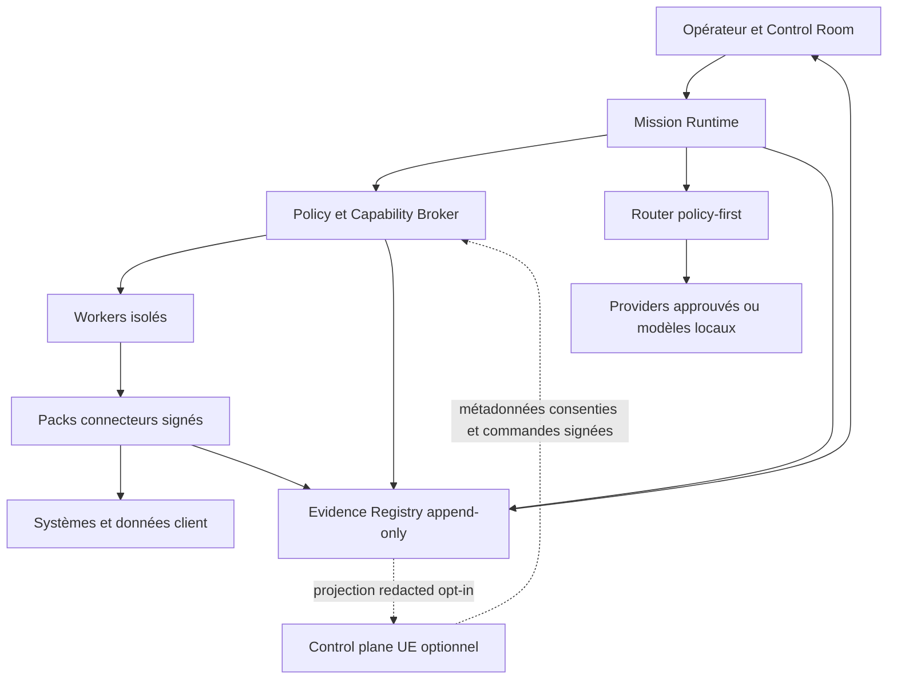

# ADR-0001 — Frontières du socle d’exploitation des missions

- Statut : accepté pour migration incrémentale
- Date : 2026-07-27
- Décideur : Robinswood
- Portée : Robb Agents, tous backends et toutes interfaces
- Remplace : aucune architecture existante ; formalise les frontières à imposer progressivement

## Contexte

Robb Agents dispose déjà de sessions multi-provider, d’un runner de tâches, de
politiques de routage, de credentials locaux, de connecteurs signés, de
gouvernance, de télémétrie et d’une supervision distante optionnelle. Ces
briques ne forment toutefois pas encore une frontière d’autorisation unique.
Des décisions restent réparties entre les permissions de session, les RPC, le
runner, les drivers connecteurs et les services privilégiés.

Le produit doit évoluer sans remplacer ces briques par un nouveau framework
transversal et sans introduire de dépendance obligatoire à Robinswood.

## Décision

L’architecture adopte quatre frontières explicites et un registre de preuves.

1. **Control plane optionnel** : inventaire, santé consentie, budgets, alertes,
   approbations distantes et commandes bornées. Il n’est jamais requis pour
   exécuter une mission locale et ne reçoit aucun contenu métier par défaut.
2. **Data plane client** : credentials, données, index, workers, états détaillés
   et preuves. Il reste local, on-premise ou dans le VPC choisi par le client.
3. **Policy et Capability Broker** : point de décision et d’application
   déterministe pour toute opération authentifiée ou mutative. Les modèles,
   runtimes, adaptateurs et connecteurs ne peuvent pas le contourner.
4. **Mission Runtime** : moteur durable et provider-agnostic. Il orchestre des
   étapes bornées mais ne crée ni permission ni credential.
5. **Evidence Registry** : journal local append-only dont les interfaces,
   exports et projections d’observabilité sont des vues dérivées.

## Invariants de frontière

- Une requête d’exécution transporte des identités explicites
  `clientId/workspaceId/missionId/agentId/connectorId` et une génération
  d’autorisation monotone.
- Une capability est courte, minimale, signée, à usage borné et liée au hash
  canonique de l’opération et de son payload.
- Un credential est résolu uniquement dans le worker autorisé et n’est jamais
  inclus dans la capability, le contexte modèle, l’audit ou un export.
- Le runtime consomme une décision du broker ; il ne réinterprète pas une
  policy et ne transforme pas un refus en fallback.
- Une révocation invalide immédiatement les nouvelles admissions. Les leases
  déjà admis sont drainés ou interrompus selon la policy explicite.
- Les adaptateurs MCP Tasks, A2A, AG-UI et OTLP restent des frontières opt-in ;
  aucun d’eux ne devient le modèle interne du produit.
- Le mode local-only est complet. Toute projection distante est désactivée par
  défaut et filtrée par allow-list de champs.

## Responsabilités

| Composant | Autorisé | Interdit |
|---|---|---|
| Control plane | superviser des métadonnées consenties, demander une approbation, émettre une commande signée et bornée | stocker les documents, conversations, tokens ou devenir une route obligatoire |
| Mission Runtime | planifier, checkpoint, reprendre, limiter les budgets, solliciter le broker | délivrer une permission, lire un secret, abaisser un risque |
| Broker | calculer la policy effective, délivrer/révoquer une capability, consommer une approbation, journaliser une décision | appeler un modèle ou contenir une logique métier de connecteur |
| Worker | exécuter exactement une capability avec des ressources bornées | conserver une capability ou un secret au-delà du lease, modifier la policy |
| Connector Pack | déclarer et exécuter des opérations métier typées | exposer un HTTP générique mutatif ou changer son risque au runtime |
| Router | choisir parmi les routes autorisées et qualifiées | contourner résidence, confidentialité, budget ou eval pour la disponibilité |
| Evidence Registry | conserver des événements corrélés et vérifiables | conserver des secrets ou du contenu non explicitement autorisé |

## Compatibilité et migration

- `packages/shared/src/tasks` reste le modèle de mission et le journal portable.
- `packages/server-core/src/tasks/TaskRunner.ts` reste le premier backend de
  runtime. Un backend Temporal doit consommer les mêmes contrats et événements.
- Les permissions `safe`, `ask`, `allow-all` restent lisibles pour compatibilité
  mais sont projetées vers les mandats A0–A4. `allow-all` n’accorde jamais W3.
- Les packs existants migrent leur champ `effect` vers `risk` sans modifier les
  identifiants d’opération. Pendant la transition, le mapping est monotone :
  `read -> R1`, `write/workspace-write -> W1`,
  `external-mutation -> W2`; W3 exige une déclaration explicite.
- Les audits existants deviennent des producteurs du registre commun. Ils ne
  sont supprimés qu’après comparaison de projection et procédure de rollback.
- JSON/JSONL restent les formats d’export. SQLite peut devenir l’index et
  l’event store local sans rendre les exports dépendants de SQLite.

## Conséquences

### Positives

- Les connecteurs et providers deviennent remplaçables sans changer les missions.
- Les décisions sensibles sont testables hors du contexte du modèle.
- La supervision Robinswood reste possible sans centraliser les données client.
- La migration est incrémentale et chaque ancien chemin garde un rollback.

### Coûts

- Chaque surface d’exécution doit être raccordée au broker avant d’être déclarée
  production-ready.
- Les identités et la génération d’autorisation doivent être propagées dans les
  RPC, événements et workers.
- Les projections UI et OTLP doivent tolérer la coexistence des événements
  historiques et v1 pendant la migration.

## Alternatives rejetées

1. **Réécriture autour d’un orchestrateur externe unique** : rejetée pour
   préserver le local-first, la portabilité et les investissements existants.
2. **Policy dans les prompts** : rejetée car non déterministe et contournable.
3. **Proxy Robinswood obligatoire** : rejeté car contraire à la souveraineté et
   au fonctionnement local-only.
4. **Connecteur HTTP générique mutatif** : rejeté car il rend les scopes, le
   risque, l’idempotence et la compensation invérifiables.

## Rollback de l’adoption

Chaque intégration du broker est livrée derrière une bascule locale, avec double
journal temporaire. Le rollback réactive l’ancien chemin pour les opérations au
plus R1/W1, jamais pour W2/W3 après activation du nouveau contrôle. Les données
v1 restent exportables et les anciens lecteurs ignorent les champs additionnels.

## Conditions de révision

L’ADR doit être révisé avant toute nouvelle destination de données, toute
centralisation obligatoire, tout changement de modèle de confiance, ou toute
capacité permettant à un modèle de modifier ses propres policies ou contrôles.

