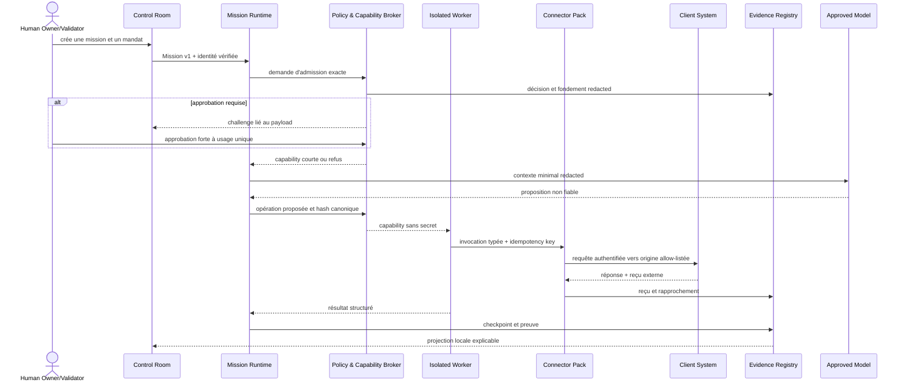

# Fondation v1 — Missions IA d’entreprise gouvernées

Date de cartographie : 2026-07-27  
Référence : brief directeur « Développements structurants de Robb Agents »  
Statut : contrat de migration validable ; ne constitue pas à lui seul une preuve de production

## 1. Inventaire vérifié de l’existant

| Domaine | Briques existantes | Maturité observée |
|---|---|---|
| Interfaces | Electron, WebUI, CLI, Control Room, kanban de tâches, inbox d’approbation | produit local réel ; parcours de gouvernance et supervision vérifié dans le navigateur officiel |
| Sessions et providers | `SessionManager`, backends Claude/Pi, connexions multi-provider | réel, responsabilités encore concentrées |
| Missions et durabilité | `tasks/schema`, `storage`, `durable-execution`, `mission-control`, `TaskRunner` | sessions, journal, checkpoints, reprise et isolation persistée réels ; les mutations externes restent refusées tant que le worker connecteur structuré n’est pas raccordé au runner |
| Routage | `routing-policy`, `routing-fallback`, `routing-audit`, evals providers | policy-first partiel, preuves de promotion réelle à compléter |
| Credentials | secure storage atomique et segmenté, clés de gouvernance par finalité, `SecretLeaseBroker` | qualifié localement sans exposition de valeur ; coffre central/HYOK et rotation distante non qualifiés |
| Connecteurs | manifeste Ed25519, registre durable, broker, leases, drivers HTTP bornés, reçus et rapprochement | runtime hôte gouverné réel et testé localement ; raccord `TaskRunner` et sandboxes fournisseurs externes encore requis |
| Gouvernance | espaces, rôles, `CapabilityBroker`, taxonomie R0–W3, mandats A0–A4, audit et kill switches | PDP/PEP local deny-by-default réel ; fédération OIDC/SAML/SCIM et diffusion multi-hôte non qualifiées |
| Télémétrie | événements corrélés, OTLP opt-in, redaction, coût et preuves signées | smoke collector local vert ; backend opéré et conservation externe non qualifiés |
| Interop | contrats internes et projections MCP Tasks/A2A/AG-UI | adaptateurs de bordure, conformité externe partielle |
| Supervision | profils locaux, transport signé, HTTP loopback et actions bornées | opt-in local/sandbox ; service managé et consentement UX à prouver |
| Evals | corpus français, gate, canary, runner provider | tests locaux ; qualification sur providers/tenants réels à compléter |
| Supply chain | audits paquet, SBOM/provenance, manifests update, installateurs multi-OS | CI réelle ; signatures/notarisation et tests installés réels selon OS restent des gates externes |

### Baseline et clôture du 27 juillet 2026

La cartographie a volontairement commencé avant toute modification
fonctionnelle. La baseline initiale échouait sur le typage du contexte de
routage, la classification OAuth/MFA et deux scénarios de reprise/échéance du
`TaskRunner`. Ces régressions ont été corrigées avant la clôture.

État local vérifié après implémentation :

- `bun run typecheck:all` : code retour 0 ;
- `npm test` : code retour 0, toutes les suites workspace exécutées passent ;
- `bun run validate:ci` : code retour 0 ;
- `bun run lint` : code retour 0, zéro erreur et 133 avertissements existants ;
- campagne de reprise : 1 000/1 000 décisions sûres, zéro violation ;
- smoke OTLP : logs, métriques et traces corrélés reçus ;
- export/restauration portable : 20 tests ciblés passent, secrets textuels
  redacted, fichiers credentials exclus et droits d’exécution importés mis en
  quarantaine ;
- validation Playwright officielle : page chargée, titre `Robb Agents`, thème,
  gouvernance et grant/revoke de supervision vérifiés, zéro erreur console,
  zéro erreur page, zéro requête échouée et aucune overflow horizontale.

Ces résultats qualifient la fondation locale. Ils ne qualifient pas les tenants
fournisseurs, les signatures de release ni un pilote client.

## 2. Carte des flux de confiance



Les contenus de modèle, e-mail, document, site ou API sont toujours des données
non fiables. Ils ne produisent jamais une permission ni une nouvelle destination.

## 3. Threat model initial

| Menace | Exemple | Contrôle requis | Preuve attendue |
|---|---|---|---|
| Spoofing | session ancienne utilisant une identité révoquée | identité liée à la génération d’autorisation, capability courte | test révocation/publication concurrente |
| Tampering | payload modifié après approbation | hash canonique identité + policy + opération + payload + expiration | test mutation d’un seul champ |
| Repudiation | agent niant une mutation | journal append-only, reçu externe, acteur et policy effectifs | vérification de chaîne et export |
| Information disclosure | token dans prompt, log ou OTLP | résolution tardive du secret, redaction allow-list, scans | tests canaris de secrets sur tous exports |
| Denial of service | mission épuisant CPU, coût ou appels | budgets et leases d’exécution, circuit breaker, kill switches | tests limites et arrêt déterministe |
| Elevation of privilege | modèle abaissant W3 en W1 | risque signé par le pack, policy uniquement restrictive | test négatif d’abaissement |
| Replay | reprise répétant un paiement | idempotency key durable + statut confirmé + rapprochement | campagne de 1 000 reprises, zéro doublon |
| Stale authorization | pack révoqué encore actif dans un pool | génération monotone et invalidation inter-processus | test pool/session ancien |
| Prompt injection | e-mail demandant d’exporter un dossier | séparation données/instructions et admission hors modèle | corpus d’eval injection |
| Supply chain | pack signé puis révoqué ou binaire altéré | provenance, signature, registre de révocation | install/revoke/tamper tests |
| SSRF/exfiltration | base URL connecteur vers une origine interne | origines signées et résolution DNS/IP contrôlée à l’exécution | tests redirect, DNS rebinding, IP privée |
| Confused deputy | approbation d’un validateur utilisée dans un autre workspace | binding client/workspace/mission/agent/connector/opération | tests de mismatch par dimension |

### Actifs à protéger

Credentials, données métiers, identités humaines et machines, policies,
approbations, capabilities, journaux, reçus, budgets, packs installés, modèles
autorisés, mémoire dérivée et artefacts de mission.

### Hypothèses interdites

- Le modèle ou un contenu externe n’est jamais une autorité.
- Un processus local n’est pas automatiquement digne de confiance.
- Une réponse HTTP 2xx ne prouve pas à elle seule la réussite métier.
- Un mock ne prouve ni un sandbox fournisseur ni la production.
- Une connexion déjà ouverte ne conserve pas implicitement une autorisation.

## 4. Matrice existant / partiel / manquant / à retirer

| Exigence | État | Action v1 |
|---|---|---|
| Mission durable et rapport | existant local | achever l’exécution structurée des nœuds non-session et connecteur |
| Broker commun à toutes les exécutions | existant local | raccorder le dernier chemin connecteur au `TaskRunner`, sans fallback permissif |
| Approbation payload-bound, single-use | existant local | qualifier MFA/double contrôle avec une identité externe réelle |
| Taxonomie R0/R1/W1/W2/W3 | existant local | maintenir le risque signé dans les packs qualifiés |
| Mandats A0–A4 | existant local | qualifier les policies client sur tenants de test |
| Révocation inter-processus | existant local/partiel multi-hôte | conserver la génération monotone ; ajouter la diffusion du control plane futur |
| Queue durable et dead-letter | existant local | ajouter métriques de durée et exercice de charge prolongé |
| Isolation commune multi-OS | partiel | chemins/outils/egress imposés ; ajouter workers OS pour CPU, mémoire et disque |
| Secret lease segmenté | existant local | qualifier rotation et révocation contre le coffre cible |
| Registre de preuves unifié | existant local | projeter vers le backend d’observabilité retenu sans payload sensible |
| Router policy-first | partiel | lier classification, budgets, eval fingerprint et canary |
| Connector Pack installable | existant local/partiel fournisseur | raccorder au runner puis qualifier Microsoft et un système non-Microsoft |
| Données permission-aware | partiel | catalogue, ACL source, provenance fragment, invalidation dérivée |
| Identité OIDC/SAML et séparation opérateur/validateur | manquant | ajouter une couche d’identité vérifiée optionnelle |
| Control Room sans terminal | existant local | compléter les parcours provider après disponibilité des tenants de test |
| OTLP désactivable | existant | raccorder au registre commun sans contenu sensible |
| Interop opt-in | existant/partiel | conserver comme adaptateurs et ajouter conformance externe |
| Supervision distante opt-in | partiel | consentement champ par champ, service et exercice de révocation |
| Exports et sortie sans Robinswood | existant local/partiel managé | bundles redacted et restore local testés ; exercer le control plane managé futur |
| HTTP générique mutatif en production | à retirer/interdire | seules les opérations signées d’un pack peuvent muter |
| `allow-all` implicite | à retirer des profils client | activation explicite, bornée, jamais W3 |
| Token partagé comme identité entreprise | à retirer | identités humaine et machine vérifiées |

## 5. Taxonomie centrale des opérations

| Niveau | Sémantique | Approbation minimale | Idempotence/compensation |
|---|---|---|---|
| R0 | lecture publique ou locale non sensible | workspace explicite | preuve de lecture si mission |
| R1 | lecture authentifiée/confidentielle | scope et ressource exacts | journal, classification, rétention |
| W1 | écriture interne réversible | mandat au moins A2 ou policy plus stricte | obligatoire + compensation |
| W2 | effet externe | approbation payload-bound sauf enveloppe A4 autorisée | obligatoire + reçu + rapprochement |
| W3 | destructif, financier ou privilégié | validation forte externe, parfois double contrôle | obligatoire + rapprochement et procédure de rollback |

Le niveau signé du pack est un minimum. Une policy peut le relever, jamais
l’abaisser. Toute opération non classée est refusée.

## 6. Mandats d’autonomie

| Niveau | Droit maximal |
|---|---|
| A0 | observer les ressources explicitement autorisées |
| A1 | recommander sans préparer dans le système cible |
| A2 | produire un brouillon ou une simulation |
| A3 | exécuter uniquement après approbation exacte |
| A4 | exécuter dans une enveloppe préapprouvée, réversible et plafonnée |

Le mandat v1 est versionné et contient objectif, identités, ressources,
opérations, classifications, budget temps/tokens/coût/outils, volume, fréquence,
durée, autonomie maximale, conditions d’arrêt, vérification, compensation,
propriétaires et escalade. W3, les engagements juridiques, exports sensibles et
changements de sécurité ne sont jamais A4.

## 7. Mission v1

Le contrat interne doit rester indépendant des providers et des protocoles de
bordure.

```text
MissionV1
  schemaVersion: 1
  id, clientId, workspaceId
  ownerId, validatorIds[], agentAssignments[]
  objective, contextRefs[], inputs[], deliverables[], successCriteria[]
  graph: nodes[] + dependencies[]
  mandateRef, policyVersion, authorizationGeneration
  budget: timeMs, inputTokens, outputTokens, cost, toolCalls, volume
  deadline, retryPolicy, compensationPolicy
  state: planned | running | waiting_approval | blocked | paused |
         completed | failed | cancelled
  revision, createdAt, updatedAt
```

Chaque nœud déclare rôle (`planner`, `executor`, `verifier`, `sentinel`),
entrées minimales, sortie structurée, risque maximal, capability demandée,
budget et stratégie de preuve. Le Human Owner reste un acteur externe au graphe.

### Transitions autorisées

- `planned -> running|cancelled`
- `running -> waiting_approval|blocked|paused|completed|failed|cancelled`
- `waiting_approval -> running|failed|cancelled`
- `blocked -> running|failed|cancelled`
- `paused -> running|cancelled`
- les états terminaux ne redeviennent jamais actifs ; un replay crée une
  nouvelle révision non mutative par défaut.

## 8. Connector Pack v1

Le manifeste signé cible les champs suivants :

```text
ConnectorPackV1
  schemaVersion, id, publisher, version, provenance, signature
  systems[], allowedOrigins[], authentication
  scopes[], resourceSelectors[], retentionPolicy
  install, rotate, revoke, uninstall, healthCheck
  operations[]:
    id, title, risk, requiredScopes, resourceSchema
    inputSchema, outputSchema, approvalPolicy
    idempotency, timeout, rateLimit
    compensation, reconciliation, receiptSchema
  contractTests, sandboxProfile, revocationGeneration
```

Le driver reçoit une capability vérifiée, jamais un simple objet
`approval: approved`. Les origines et méthodes proviennent du manifeste signé.
Les redirects, DNS résolus et destinations finales sont revérifiés. Toute
mutation retourne un reçu externe et un statut de rapprochement.

## 9. Événement v1 et corrélation

```text
EnterpriseEventV1
  schemaVersion: 1
  eventId, eventType, occurredAt, sequence
  clientId, workspaceId, missionId, runId, sessionId
  turnId, generationId, agentId, toolCallId
  connectorId, operationId, externalReceiptId
  policyVersion, decisionId, capabilityId, authorizationGeneration
  risk, autonomy, state, outcome, reasonCode
  cost: amount, currency, source, priceSheetDate
  evidenceRefs[], reconciliationStatus
  previousHash, hash
```

Le payload métier n’est pas un champ générique de l’événement. Les artefacts
sensibles restent dans le data plane et sont référencés par un identifiant soumis
à la même policy. Les producteurs historiques peuvent omettre les dimensions
inconnues, mais aucun producteur ne peut inventer une identité.

## 10. Plan de migration et compatibilité

1. **Stabiliser la baseline** : corriger typecheck et tests de reprise/échéance.
2. **Introduire les contrats centraux** : risques, mandats, identités,
   décisions, capabilities et événements, sans changer les anciennes API.
3. **Créer le broker local** : deny-by-default, approvals single-use,
   génération monotone, kill switches et journal explicable.
4. **Raccorder le TaskRunner** : admission de chaque nœud, retry durable,
   idempotence et replay read-only.
5. **Raccorder les connecteurs** : manifester R0–W3, payload binding, origine,
   reçu et rapprochement. Microsoft 365 et Google Workspace servent de preuve
   de portabilité, jamais d’exception dans le cœur.
6. **Raccorder les autres surfaces** : RPC, outils de session, MCP locaux,
   navigateur, passerelles de messagerie et exécution privilégiée.
7. **Unifier les événements** : double écriture temporaire, vérification des
   projections, puis retrait des audits divergents.
8. **Rendre le produit opérable** : Control Room, inbox, audit explorer,
   budgets, permissions, révocation et export/restauration.
9. **Qualifier** : evals, canary, chaos 1 000 reprises, sandbox connecteurs,
   conformance interop et tests installés multi-OS.
10. **Piloter** : verticale multi-systèmes sur tenants de test, métriques, revue
    sécurité indépendante et décision humaine avant toute nouvelle destination.

Chaque étape garde une bascule de compatibilité, un export portable et un plan
de rollback. Aucun ancien chemin mutatif n’est conservé comme fallback après
activation du broker.

## 11. Première verticale de référence

Playbook : détecter un écart entre une donnée opérationnelle et une donnée de
facturation, préparer la correction, obtenir la validation, mettre à jour les
deux systèmes autorisés, rapprocher les reçus et produire le rapport.

- Pack A : Microsoft 365 ou Google Workspace pour les pièces ciblées.
- Pack B : CRM/ERP/comptabilité de test.
- Même Mission v1, aucun nœud spécifique à Microsoft dans le noyau.
- W2 pour la mise à jour métier ; W3 si un paiement, une suppression ou un
  changement de droit est introduit, avec double contrôle hors modèle.

## 12. Gates de preuve

| Niveau de preuve | Libellé produit autorisé |
|---|---|
| type/contrat uniquement | expérimental, non exécutable |
| mock déterministe | test unitaire, non qualifié fournisseur |
| sandbox local | intégration locale |
| sandbox fournisseur/tenant test | qualifié sandbox, avec date et version |
| pilote client limité | pilote, périmètre et limites publiés |
| production observée | production-ready uniquement après SLO, sécurité et rollback prouvés |

La complétion du brief exige au minimum : typecheck et tests verts, zéro secret
dans les exports, course révocation/retry testée, campagne de reprise supérieure
à 99 % sur 1 000 scénarios, zéro mutation dupliquée, UI validée dans le navigateur
officiel, sandbox Microsoft et non-Microsoft, restore/exit testés et artefacts de
release signés selon la plateforme. Les éléments nécessitant un tenant, une
signature, un service distant ou un pilote ne peuvent pas être remplacés par un
mock ni déclarés terminés localement.

## 13. Qualification datée et décision de mise en service

La preuve consolidée de cette livraison est publiée dans
`docs/robinswood/qualification-status-2026-07-27.md`. Elle distingue trois
états sans ambiguïté : vérifié localement, refusé de façon sûre, et non exécuté
faute de dépendance externe. La clôture indépendante des constats de sécurité
est détaillée dans
`docs/robinswood/independent-security-review-closure-2026-07-27.md`.

Une décision de mise en service ne peut être déduite de la seule réussite
locale. Elle exige les gates fournisseur, interopérabilité, signature,
installation et pilote listées dans le statut de qualification, avec preuves
datées et identité de l'approbateur humain.
