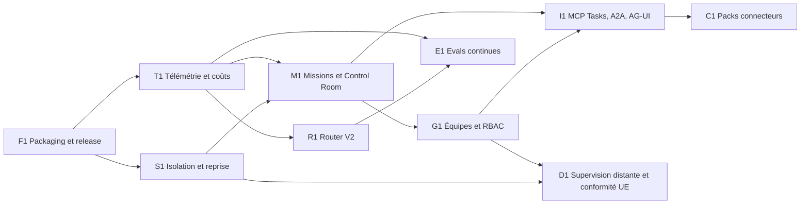

# Robb Agents — plan d’exécution produit et technologique 2026

Date de référence : 2026-07-23
Horizon : 6 mois
Statut : fondations techniques exécutées, recette locale terminée

## Résultat recherché

Faire de Robb Agents un poste de travail agentique français gouverné, auditable et exploitable en équipe, sans reproduire un orchestrateur généraliste de type n8n.

Le produit doit gagner sur quatre axes :

1. **fiabilité opérationnelle** : isolation, reprise, idempotence et observabilité ;
2. **gouvernance** : politiques, RBAC, audit, provenance et budgets ;
3. **expérience métier** : missions récurrentes, validation humaine et supervision ;
4. **interopérabilité ouverte** : MCP, tâches asynchrones, A2A et UI agentique.

## Principes de décision

- Une action externe doit être explicable, idempotente et rejouable.
- Une route LLM interdite par policy ne devient jamais autorisée pour améliorer la disponibilité.
- Un coût sans source reste `unavailable` ; il n’est jamais présenté comme réel.
- Les secrets restent dans les chemins de credentials dédiés et ne transitent pas dans les exports.
- Les automatisations privilégient des playbooks métier bornés plutôt qu’un canvas d’automatisation générique.
- Toute capacité sensible est livrée derrière une permission, un journal d’audit et un kill switch.
- Une phase n’est terminée que lorsque ses critères d’acceptation et ses tests sont verts.

## Contrat permanent de développement, staging et release

Le cycle desktop repose sur trois cibles distinctes. Leur séparation fait
partie des critères de fiabilité du produit.

| Niveau | Cible et données | Usage | Condition de sortie |
|---|---|---|---|
| Développement | **Robb Agents Dev**, `io.robinswood.robbagents.dev`, `~/.craft-agent-dev` | développement courant, tests isolés et itérations rapides | tests pertinents verts sans accès ni mutation de `~/.craft-agent` |
| Staging local | `/Applications/Robb Agents.app`, identité production, `~/.craft-agent` | tester le candidat sur ce Mac avec les chats, connexions, état navigateur et MCP réels | paquet issu d’un commit propre, sauvegarde restaurable, contrôles techniques verts et résultat utilisateur accepté |
| GitHub Release | artefacts publics signés et vérifiés | distribution d’une nouvelle version | staging local accepté, CI multi-OS verte, signatures/notarisation/checksums/provenance vérifiés |

Ordre de promotion obligatoire :

1. développer et tester par défaut dans le profil isolé
   `~/.craft-agent-dev` ;
2. construire explicitement le candidat avec
   `bash apps/electron/scripts/build-dmg.sh arm64 --local-production` ;
3. sauvegarder le bundle installé, remplacer l’application production locale,
   puis vérifier le commit embarqué, le chemin runtime
   `~/.craft-agent/robb-electron`, les sessions, connexions et MCP ;
4. obtenir l’acceptation explicite du résultat de staging ;
5. seulement ensuite créer le tag et la GitHub Release via le workflow signé.

Une fusion dans `main` peut précéder cette recette, mais ne vaut jamais
publication. Le paquet local ad hoc sert uniquement au staging de ce Mac et ne
doit pas être distribué. Le profil développement n’est pas une anomalie :
l’incident à éviter est son installation sur la cible production/staging.

## Baseline vérifiée

| Capacité | État au 2026-07-23 | Preuve dans le dépôt |
|---|---|---|
| Français natif et rebrand Robb | Livré | locale, assets, metadata Electron et smoke tests |
| Router policy-first par tour | Livré | `routingPolicy`, sensibilité, allow-list |
| Fallback router fail-closed | Livré | fallback unique avant streaming et `routingMeta` |
| Audit provider/modèle/coût | Partiel | coût SDK, agrégat session, exports presse-papiers |
| Playbooks et automatisations | Partiel | builtins, validation, storage et UI |
| Autonomie gouvernée | Partiel | décision, preuve, politique d’exécution et dead-letter |
| Release signée multi-OS | Partiel | workflow, checksum, SBOM et provenance ; aucun release public publié |
| Isolation d’exécution | À renforcer | permissions présentes, sandbox de tâches à industrialiser |
| Missions et Control Room | À construire | pas de modèle produit unifié |
| Équipes, espaces et RBAC | À construire | gouvernance surtout locale/workspace |
| Evals produit continues | À construire | tests unitaires présents, corpus métier manquant |
| MCP Tasks, A2A et AG-UI | À construire | MCP existant, contrats asynchrones à ajouter |
| Supervision distante | À construire | application desktop locale uniquement |

## Benchmark marché vérifié

Sources officielles consultées le 2026-07-23. Les fonctions annoncées en
preview sont considérées comme des signaux de trajectoire et non comme des
capacités GA.

| Référence | Standard de marché observé | Écart ou opportunité pour Robb Agents | Réponse dans la feuille de route |
|---|---|---|---|
| [OpenAI Codex](https://openai.com/index/introducing-the-codex-app/) | centre de commande multi-agents, exécution parallèle en worktrees, skills, automatisations, sandbox et disponibilité macOS/Windows ; [supervision mobile et accès distant](https://openai.com/index/work-with-codex-from-anywhere/) | la concurrence est déjà forte sur le développement logiciel pur ; Robb doit gagner sur les missions transverses, le choix de modèles et la gouvernance locale/UE | M1 Control Room, S1 isolation/reprise, D1 supervision distante opt-in |
| [Anthropic Claude Code](https://www.anthropic.com/product/claude-code) | agent de code terminal capable de modifier, tester et intégrer ; les [patterns avancés](https://resources.anthropic.com/hubfs/Claude%20Code%20Advanced%20Patterns_%20Subagents%2C%20MCP%2C%20and%20Scaling%20to%20Real%20Codebases.pdf) mettent en avant subagents, hooks et MCP | Robb ne doit pas se limiter à une surcouche de chat ou de terminal ; les playbooks métier, les preuves et les politiques doivent devenir des objets produit | M1 Missions, G1 ressources gouvernées, C1 packs connecteurs |
| [Cursor Background Agents](https://docs.cursor.com/background-agent) | agents asynchrones dans des machines Ubuntu isolées, avec suivi, reprise en main et accès réseau | l’exécution distante est attendue, mais elle augmente l’exposition des données et les risques d’exfiltration ; le local-only doit rester un avantage explicite | S1 sandbox et secrets bornés, D1 local-first avec consentement champ par champ |
| [Microsoft Copilot Studio](https://learn.microsoft.com/en-us/microsoft-copilot-studio/whats-new) | computer use, réponses asynchrones, inventaire d’agents, identités Entra, audit/replay et évaluations ; les [workflows](https://www.microsoft.com/en-us/microsoft-copilot/blog/copilot-studio/new-and-improved-computer-using-agents-a-new-workflows-experience-and-real-time-voice-experiences/) réunissent API, approbations, logique métier et automatisation UI | Robb doit rendre l’administration, l’identité agent, la validation humaine, les évaluations et le replay visibles dans l’interface, pas seulement disponibles dans le code | G1 RBAC/audit, M1 inbox HITL/replay, E1 eval gate ; computer use reste derrière permission explicite |
| [Google Gemini Enterprise](https://cloud.google.com/gemini-enterprise/agents) | catalogue central, gouvernance, création d’agents, marketplace et A2A ; l’[enregistrement A2A](https://docs.cloud.google.com/gemini/enterprise/docs/register-and-manage-an-a2a-agent) est encore signalé en preview et certains flux peuvent contourner l’Agent Gateway | l’interopérabilité devient un critère d’achat, mais elle doit rester policy-first et observable | I1 adaptateurs opt-in, identité et plafonds de permissions ; C1 manifestes signés et révocation |
| [LangGraph](https://docs.langchain.com/oss/python/langgraph/overview) | exécution durable, streaming, persistance, mémoire et human-in-the-loop ; les [checkpoints](https://docs.langchain.com/oss/python/langgraph/persistence) permettent reprise, time travel et tolérance aux pannes | la reprise après interruption et l’approbation humaine sont désormais des attentes de base pour les agents longs | S1 checkpoints/idempotence/dead-letter, M1 pause/reprise/annulation/HITL |
| Standards émergents | [MCP Tasks](https://modelcontextprotocol.io/specification/2025-11-25/basic/utilities/tasks) formalise les tâches durables mais reste expérimental ; [A2A](https://a2a-protocol.org/latest/specification/) couvre découverte, envoi, streaming et cycle de vie ; [AG-UI](https://docs.ag-ui.com/concepts/events) définit des événements de run, texte, outil et état ; [OpenTelemetry GenAI](https://opentelemetry.io/docs/specs/semconv/gen-ai/) structure l’observabilité | adopter tôt sans coupler le cœur du produit à des contrats encore mouvants | I1 adaptateurs versionnés et désactivables, tests de contrat externes ; T1 schéma interne stable et export OTLP |

### Positionnement recommandé

1. **Ne pas affronter les IDE agents sur leur seul terrain.** Robb Agents doit
   être le poste de travail gouverné des missions qui traversent code,
   documents, web, messagerie et outils métier.
2. **Faire du local-first un choix vérifiable.** L’utilisateur doit savoir
   quelles données quittent sa machine, vers quel provider, sous quelle
   politique et pour quel coût ; le distant reste opt-in.
3. **Mettre Mission et Control Room au centre de l’UX.** L’objet principal
   n’est plus une conversation, mais un objectif avec budget, livrables,
   échéance, preuves, approbations et reprise.
4. **Traiter gouvernance et évaluation comme des fonctions produit.** RBAC,
   inventaire, audit rejouable, identité agent, test sets et comparaison de
   versions doivent être visibles et exportables.
5. **Utiliser des frontières ouvertes mais bornées.** MCP Tasks, A2A, AG-UI
   et les packs connecteurs passent par des adaptateurs versionnés, signés,
   révocables et limités en permissions.
6. **Vendre la fiabilité mesurable.** Les SLO de reprise, latence, coût,
   duplication d’actions et qualité sur corpus français doivent conditionner
   chaque release.

### Priorités issues de la comparaison

| Rang | Évolution | Pourquoi maintenant | Indicateur de succès |
|---:|---|---|---|
| 1 | Mission, Control Room et inbox HITL | devient la différenciation visible face aux copilotes de code | une mission longue peut être supervisée, interrompue, reprise et auditée sans terminal |
| 2 | Exécution durable et isolation | parité minimale avec les agents asynchrones et condition de confiance | reprise > 99 %, aucune mutation dupliquée, tests d’évasion verts |
| 3 | Gouvernance équipe et evals | déjà intégrées aux offres enterprise des grands challengers | toute release a un rapport d’eval et toute action sensible a une identité/policy |
| 4 | Connecteurs métier signés | levier de valeur hors développement logiciel | installation/révocation vérifiables et premier playbook client complet |
| 5 | Interopérabilité MCP Tasks/A2A/AG-UI | évite l’enfermement fournisseur et prépare les écosystèmes multi-agents | deux tests de contrat externes par protocole supporté |
| 6 | Supervision distante souveraine | attendue par les usages asynchrones, mais différenciante seulement si le consentement est précis | local-only par défaut, journal de consentement et exercice de restauration |

## État d’exécution de cette branche

La branche `codex/market-roadmap-foundations` livre les contrats, garde-fous et
verticales techniques qui rendent la feuille de route exécutable. Elle ne
transforme pas en succès des validations qui nécessitent encore une autre
plateforme, un service distant ou un pilote client.

| Lot | Livré dans la branche | Validation ou déploiement restant |
|---|---|---|
| F1 | audit récursif des paquets, budgets CI, contrôles DMG/ZIP/AppImage/NSIS et mesure macOS arm64 | signatures/notarisation et lancement réels Windows/Linux |
| T1 | événements OpenTelemetry versionnés, corrélation, redaction et provenance des coûts | validation sur un collecteur OTLP de production choisi par le client |
| R1 | classification locale, route explicable, budget, policy, fallback borné et circuit breaker | calibration continue sur trafic et corpus métier élargi |
| S1 | garde-fous chemins/réseau, baux secrets, kill switches, checkpoints, idempotence et dead-letter | campagne longue de 1 000 reprises et sandbox OS durcie par plateforme |
| M1 | schéma Mission, Control Room, inbox HITL, pause/reprise/annulation, replay et rapport | test navigateur officiel de l’application desktop |
| G1 | espaces, matrice RBAC, ressources versionnées, mémoire avec provenance, export/purge et audit chaîné | écrans d’administration et stockage partagé multi-utilisateur |
| E1 | corpus français, scores, thresholds, baseline, fingerprint et gate de canary en CI | alimentation par sorties réelles des modèles/providers |
| I1 | adaptateurs opt-in MCP Tasks, A2A et AG-UI avec identité, audit, timeout et plafond de permissions | tests contre deux implémentations externes réelles |
| C1 | manifeste signé, installation/révocation, scopes, rate limits, healthcheck, compensation et cinq templates | drivers OAuth/API réels et playbooks métiers propres à chaque client |
| D1 | local-only par défaut, consentement champ par champ, actions distantes bornées, audit signé, manifeste UE et reprise | service distant, interface, DPA/sous-traitants réels et exercice de restauration |

Les critères non exécutables localement restent volontairement ouverts : ils
ne doivent pas être interprétés comme livrés par la seule présence d’un
contrat TypeScript ou d’un mock.

## Preuves de validation locale

Recette exécutée le 2026-07-23 :

- `bun run validate:ci` : succès ; typecheck de tous les packages, 130 tests
  partagés, 6 tests d’audit de paquet, 19 tests d’outils documentaires et
  contrôles i18n passés ;
- tests ciblés des nouveaux contrats et des évolutions Mission/Router :
  165 succès, 0 échec ;
- `bun run electron:build` : succès pour main, preload, renderer, ressources et
  assets ;
- paquet macOS arm64 : audit récursif vert, 1 931 fichiers, 708,2 Mio
  décompressé, DMG 230,9 Mio, ZIP 232,1 Mio et checksums SHA-256 valides ;
- lancement isolé du paquet macOS pendant 8 secondes : succès ;
- `git diff --check` : succès ;
- scan des nouvelles briques : aucun `any`, `as any`, `@ts-ignore` ou
  `@ts-expect-error` ajouté.

Limites de la recette :

- la validation UI Playwright reste bloquée : aucun template officiel Robb
  Agents/Craft Agents n’est présent dans le Rulebook ; aucun script ad hoc ni
  template d’un autre produit n’a été utilisé ;
- le lint agrégé ne peut pas démarrer car les scripts référencés
  `scripts/check-raw-sends.sh` et `scripts/check-task-tool-checks.sh` sont
  absents du dépôt ; les fichiers Electron modifiés passent le lint avec
  0 erreur et 7 avertissements existants, et les fichiers Shared modifiés
  passent avec 0 erreur ;
- la suite brute `bun test` parcourt aussi la copie de l’application présente
  dans `apps/electron/release`, ce qui duplique les tests. Le test isolé
  `browser-pane-manager.test.ts`, non modifié par cette branche, conserve
  68 succès et 8 échecs de baseline. Le gate maintenu par le dépôt
  `validate:ci` est vert.

## Dépendances

## Ordre d’exécution

### Phase 1 — fondations distribuables, 0 à 6 semaines

#### F1 — packaging et release reproductibles

Priorité : P0
État initial : partiel

Travaux :

- bloquer l’inclusion de `release-artifacts`, d’installateurs ou de paquets imbriqués dans l’application distribuée ;
- publier un inventaire de taille par composant ;
- fixer des budgets CI distincts pour l’application décompressée et les installateurs ;
- conserver checksum, SBOM, provenance, signature et test d’installation isolé ;
- mesurer démarrage à froid, mémoire au repos et taille des artefacts.

Critères d’acceptation :

- aucun composant interdit dans les bundles macOS, Windows et Linux ;
- audit de paquet exécutable localement et en CI ;
- installateur compressé inférieur à 450 Mio ou exception documentée et versionnée ;
- application installée sans artefact récursif ;
- smoke test d’installation et de lancement vert sur chaque OS.

#### T1 — OpenTelemetry, coûts et provenance versionnés

Priorité : P0
État initial : partiel

Travaux :

- introduire un schéma d’événement versionné pour session, tour, appel outil, fallback, permission et coût ;
- exporter traces, métriques et logs via OTLP sans imposer un backend ;
- remplacer le taux EUR figé par une grille tarifaire datée et une source de conversion explicite ;
- distinguer coût provider, coût SDK, estimation locale et coût indisponible ;
- ajouter corrélation `missionId` → `sessionId` → `turnId` → `toolCallId`.

Critères d’acceptation :

- aucun secret ou contenu sensible exporté par défaut ;
- schéma versionné et testé en compatibilité descendante ;
- 100 % des appels outils ont un statut, une durée et un identifiant corrélé ;
- les coûts gardent leur source et leur date de grille ;
- export OTLP désactivable par workspace.

#### R1 — Router V2

Priorité : P0
État initial : partiel

Travaux :

- classifier localement difficulté, sensibilité, outils, vision et contexte requis ;
- ajouter budgets par session, mission et workspace ;
- calculer une route explicable avec alternatives rejetées ;
- étendre fallback à une machine d’état bornée avec circuit breaker ;
- évaluer qualité, latence et coût sur un corpus stable.

Critères d’acceptation :

- aucune route hors allow-list ;
- explication lisible de la route et des alternatives rejetées ;
- arrêt ou validation humaine avant dépassement de budget ;
- taux de réussite des routes autorisées supérieur à 97 % sur le corpus ;
- régression qualité détectée avant merge.

#### S1 — isolation, secrets et reprise

Priorité : P0
État initial : partiel

Travaux :

- exécuter les tâches autonomes dans un espace de travail isolé avec limites CPU, mémoire, durée et réseau ;
- monter les secrets à la demande avec durée de vie et périmètre minimaux ;
- persister checkpoints, clés d’idempotence, statut et preuve d’action ;
- reprendre proprement une tâche après crash sans répéter une mutation confirmée ;
- ajouter kill switch global, workspace et mission.

Critères d’acceptation :

- évasion de workspace et accès secret non autorisé bloqués par tests ;
- reprise de 1 000 tâches synthétiques supérieure à 99 % ;
- aucune mutation externe dupliquée lors d’une reprise ;
- kill switch testé ;
- dead-letter inspectable et rejouable après approbation.

### Phase 2 — exploitation quotidienne, 6 à 12 semaines

#### M1 — Missions et Control Room

Priorité : P0
État initial : à construire

Travaux :

- modéliser une mission avec objectif, entrées, livrables, budget, échéance et politique ;
- afficher progression, événements, blocages, coût et prochaines actions ;
- unifier les demandes de validation humaine dans une inbox ;
- permettre pause, reprise, annulation, retry et replay depuis un checkpoint ;
- produire un rapport de mission exportable et auditable.

Critères d’acceptation :

- une mission survit au redémarrage de l’application ;
- une action à fort impact attend une validation explicite ;
- le replay n’exécute pas de mutation externe par défaut ;
- chaque blocage expose cause, propriétaire et action de résolution ;
- navigation de 1 000 sessions sous 500 ms au p95 sur la machine de référence.

#### G1 — équipes, espaces, RBAC et mémoire

Priorité : P1
État initial : à construire

Travaux :

- ajouter espaces personnels, équipe et client ;
- introduire rôles propriétaire, administrateur, opérateur, validateur et lecteur ;
- versionner politiques, playbooks et connexions par espace ;
- attacher origine, auteur, date, sensibilité et durée de rétention à la mémoire ;
- permettre export et suppression ciblés.

Critères d’acceptation :

- matrice RBAC testée sur les opérations sensibles ;
- aucun secret inclus dans partage ou export ;
- politique effective et auteur visibles pour chaque exécution ;
- mémoire désactivable et purgeable par espace ;
- journal d’audit immuable pour les changements de rôle et policy.

#### E1 — evals et non-régression

Priorité : P0
État initial : à construire

Travaux :

- créer des corpus métier français et des cas de confidentialité ;
- scorer réussite outil, respect policy, factualité, latence, coût et besoin de reprise humaine ;
- rejouer les evals sur chaque changement de prompt, modèle, router ou connecteur ;
- conserver baseline, écarts et artefacts d’évaluation ;
- ajouter canary local avant activation d’une nouvelle route.

Critères d’acceptation :

- aucun changement router/provider sans rapport d’eval ;
- seuils bloquants versionnés ;
- résultats reproductibles avec versions de modèles et de prompts ;
- couverture des actions destructives et des erreurs de provider ;
- rapport lisible par produit et technique.

### Phase 3 — écosystème et déploiements clients, 3 à 6 mois

#### I1 — protocoles agentiques ouverts

Priorité : P1
État initial : à construire

Travaux :

- adapter les opérations longues à un contrat de tâches asynchrones MCP ;
- exposer délégation et découverte d’agents via une passerelle A2A opt-in ;
- diffuser événements et validations via un adaptateur AG-UI ;
- conserver le modèle interne indépendant des protocoles ;
- appliquer les mêmes politiques, identités et audits aux trois adaptateurs.

Critères d’acceptation :

- compatibilité contractuelle testée avec au moins deux implémentations externes ;
- timeout, annulation et reprise couverts ;
- aucune élévation de permission entre protocoles ;
- adaptateurs désactivables séparément ;
- versions de protocole visibles dans l’audit.

#### C1 — packs connecteurs et playbooks métier

Priorité : P1
État initial : partiel

Travaux :

- livrer des packs bornés Microsoft 365, Google Workspace, Slack/Teams, CRM et ERP ;
- fournir authentification, scopes minimaux, healthcheck, rate limiting et tests contractuels ;
- distribuer des playbooks PME, cabinet, direction financière, RH et opérations ;
- signer et versionner manifests, permissions et provenance ;
- mesurer adoption, échec et intervention humaine.

Critères d’acceptation :

- installation et révocation testées ;
- scopes affichés avant connexion ;
- contrat et mocks disponibles pour chaque connecteur ;
- aucune action d’écriture sans mode d’approbation déclaré ;
- rollback ou compensation documenté pour toute mutation.

#### D1 — supervision distante et conformité UE

Priorité : P1
État initial : à construire

Travaux :

- proposer une vue distante opt-in pour statut, validation, pause et annulation ;
- conserver les données de mission localement sauf métadonnées explicitement synchronisées ;
- documenter résidence, rétention, sous-traitants et modes souverains ;
- ajouter export d’audit signé et politiques client ;
- préparer dossier pilote avec sauvegarde, restauration et plan de sortie.

Critères d’acceptation :

- aucune synchronisation distante sans consentement administrateur ;
- données synchronisées documentées champ par champ ;
- mode local-only pleinement fonctionnel ;
- export d’audit vérifiable ;
- tests de restauration et de révocation réussis.

## SLO produit

| Indicateur | Cible |
|---|---:|
| Démarrage à froid desktop p95 | < 2,5 s |
| Mémoire au repos | < 400 Mio |
| Navigation sur 1 000 sessions p95 | < 500 ms |
| Reprise de mission après crash | > 99 % |
| Réussite des appels outils autorisés | > 97 % |
| Mutations externes dupliquées après reprise | 0 |
| Événements d’exécution corrélés | 100 % |
| Actions à fort impact sans validation | 0 |

## Gates de livraison

Chaque lot doit passer, selon son périmètre :

1. TypeScript strict sans `any` nouveau ;
2. tests unitaires et d’intégration ;
3. tests de contrat pour providers et connecteurs ;
4. audit de sécurité des permissions et secrets ;
5. build Electron et audit du paquet ;
6. smoke test d’installation ;
7. validation navigateur officielle pour toute modification UI ;
8. changelog, migration et rollback documentés.

## Hors périmètre

- remplacement d’outils d’automatisation généralistes ;
- hébergement obligatoire des conversations par Robinswood ;
- marketplace non modérée de code exécutable ;
- auto-amélioration de policy sans validation humaine ;
- promesse de souveraineté fondée uniquement sur la localisation d’un modèle.
